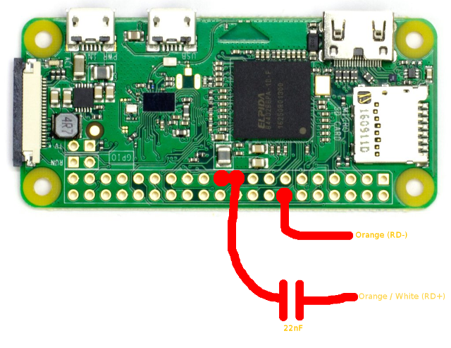

# SPI10M

This project is a Linux kernel module that implements a 10Mbps Ethernet transmitter using the SPI peripheral that is present in many SoCs. This is very handy with low cost Single Board Computers that don't have an Ethernet interface. Note that the link is simplex only. You can only send packets. This makes it less useful, but it has been used successfully for the following applications:
* Video data transfer (MPEG-TS and RTP stream)
* Audio data transfer (RTP stream)
* Remote syslog
* Device for uploading new firmware to other device

Another use case may be a data diode. In general, one way protocols that use UDP will work. You will need to add a static IPv4 ARP entry or IPv6 neighbor if you are not using a broadcast destination.

### Software installation
These instructions are written for the Raspberry Pi. However, nothing here is specific for this SBC. You can use the instructions with minor modifications on many platforms: the Orange Pis, the Odroids, and many more. It should even work on a standard PC, if it has a SPI interface card installed. The only absolute prerequisite is that the SPI interface can operate at a clock of 20MHz. Furthermore, there should be no delay cycles between sending bytes. This is usually not a problem when the driver uses DMA to drive the peripheral. PIO/Interrupt based drivers will almost certainly not work. Bitbanged drivers will not work for obvious reasons.

The first step is compiling the kernel module. Clone the git repository and run make. The repository was cloned as 'mc' in this example:
```sh
~/mc/driver/$ make
make -C /lib/modules/`uname -r`/build M=$PWD
make[1]: Entering directory '/home/pi/linux-233755da0e7903fccb41f0b8c14e1da5244b69ec'
  LD      /home/pi/mc/driver/built-in.o
  CC [M]  /home/pi/mc/driver/spi10m.o
  Building modules, stage 2.
  MODPOST 1 modules
  CC      /home/pi/mc/driver/spi10m.mod.o
  LD [M]  /home/pi/mc/driver/spi10m.ko
make[1]: Leaving directory '/home/pi/linux-233755da0e7903fccb41f0b8c14e1da5244b69ec'
```
Should you get an error, it may be the case that your system does not have the kernel sources installed. To fix this, see the bottom of this page.

Now install the module:
```sh
~/mc/driver/$ sudo make modules_install
make -C /lib/modules/`uname -r`/build M=$PWD INSTALL_MOD_DIR=kernel/net/802 modules_install
make[1]: Entering directory '/home/pi/linux-233755da0e7903fccb41f0b8c14e1da5244b69ec'
  INSTALL /home/pi/mc/driver/spi10m.ko
  DEPMOD  4.4.11+
make[1]: Leaving directory '/home/pi/linux-233755da0e7903fccb41f0b8c14e1da5244b69ec'
depmod -a `uname -r`
```

Install the device tree overlay on the SD card:
```sh
~/mc/$ sudo cp devicetree/spi10m.dts /boot/overlays/
```

Now you need to update /boot/config.txt to activate the interface and configure the clocks correctly. An example config.txt is included in the repository. Reboot your Raspberry Pi after you are done.

Now you should be able to load the module:
```sh
~/$ sudo modprobe spi10m spi10m_preamble_length=128
```
The command should not give any error, and a new Ethernet interface should appear.

The module parameter (spi10m_preamble_length) sets the preamble length to 128 bytes. Normal Ethernet uses only 8 bytes. Since we drive the line way out-of-spec using just a capacitor this may be needed to improve reliability. In my experience everything higher than 32 works with all cards. I put 128 to be extra safe. The overhead is quite small, unless you have many very short packets.

The line is not driven differentially. Do not use long cables since this may result in EMI problems (aim for less than 15cm). You may also get a significant amount of lost packets or just no packets at all due to our weak drive when your cable is too long. Use a more elaborate line driver circuit with a buffer and transformer if you want to use a long cable. With this you should reach the same distance as normal Ethernet and not need the longer preamble. If you need this it may be easier to just buy an Ethernet module that you can run of the SPI :).

You can configure the system to load the module automatically on boot:
```sh
~/$ echo "spi10m" |sudo tee -a /etc/modules
~/$ echo "options spi10m spi10m_preamble_length=128" |sudo tee /etc/modprobe.d/spi10m.conf
```

After reboot the Ethernet interface should now be always there. If you complete the next section and plug the cable into another computer you should be able to send traffic (simplex, of course). The driver does not do auto-negotiation since it has no receive path. You may want to set the remote port to full duplex to reduce the risk of packet loss due to collisions. For example, on linux, you can do this with ethtool:
```sh
> sudo ethtool -s enp0s31f6 speed 10 autoneg off duplex full
```

### Hardware preparation
In this section we will explain how to connect the Ethernet cable to your board. This program sends the packets over the SPI interface. The packets come out of the MOSI (Master Out, Slave In) pin. You should connect this pin through a 22nF capacitor to the TX+ pin of the Ethernet connector. Simply connect TX- to ground. 

Which wires to use for TX+ and TX- depends on whether you will plug the cable into a switch or directly into another Ethernet interface. Fortunately, most modern Ethernet ports can switch roles, and thus both ways will work. 

Connecting to a switch:
* TX+: Pin 1 (Usually green/white striped wire, verify the colors, many cables are mis-wired!)
* TX-: Pin 2 (Usually green wire)

Connecting to a NIC:
* TX+: Pin 3 (Usually orange/white striped wire)
* TX-: Pin 6 (Usually orange wire)

You need to know where the MOSI pin is on the board you are using. The following picture shows where to connect the wires on a Pi Zero:




### Kernel source installation on Raspberry Pi
Run the following commands to download the kernel sources and install them. If you are not using a Raspberry Pi or are cross compiling you will need to know how to do this for your platform.
```sh
~/$ sudo wget https://raw.githubusercontent.com/notro/rpi-source/master/rpi-source -O /usr/bin/rpi-source
~/$ sudo chmod +x /usr/bin/rpi-source
~/$ /usr/bin/rpi-source -q --tag-update
~/$ rpi-source
```
It may take some time to install the sources, depending on the speed of the SD card.
